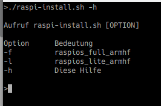

# Raspi-auto-downloader 

05.05.2022 Diese Version kann jetzt Images die mit xz gepackt wurden.

Was ich bisher getestet habe:
1. Raspbian Light: download; hash-check; SD
2. Raspbian Light 64;download; hash-check
3. Bei den restlichen Raspberry-Images hab ich nur den Download angestoßen. Hat funktioniert.

. Shellchecked

Load fresh images for the Raspberry 
Pi, check SHA256, and copy to SD-Card, a Bashscript.

Jetzt auch mit den 64er Images

## Hilfe raspi-install.sh -h

## Copy and check SD-Image

## Fork, Issue, Pull request, Clone
Be carefull, this  script is in status Beta 0.3 !

## Bei fehlenden Rootrechten zum Schreiben auf SD-Karte

Wenn die Karte nur als Root gemountet werden kann, muss dd durch sudo dd ersetzt werden. umount -> sudo umount. Gilt ab Zeile 105

### Alternative für Ubuntu:

echo 'KERNEL=="sd*", SUBSYSTEMS=="usb", MODE="0666"' | sudo tee /etc/udev/rules.d/99-usb-storage.rules

Quelle : https://askubuntu.com/questions/828545/using-dd-without-sudo

